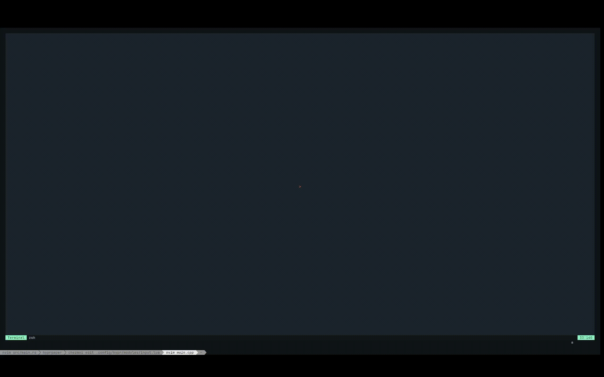
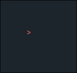
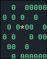
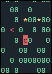
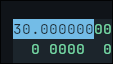

# terminal-factory


a TUI factory management game

hello! have you ever been sshed into a server or another pc, and wanted to play a factory management game?? but sadly, you dont have a graphical env!! no worries!! this horrendous terminal factory management should keep you entertained!!

## video of intense gameplay



## exciting screenshots






## keybinds

| bind(s) | action |
| ------- | ------ |
| y, w | move up |
| i, s | move down |
| c, a | move left |
| e, d | move right |
| space | place drill |
| q, ^c | quit |

## how to play/run

ok so

cross compilation with c++ is really hard

_...and ncurses is linux only. sorry!_

so just download the `tf` binary from the repo, then cd next to it and run:

``` ./tf ```

enjoy!

## misc stuff

so this is actually my first time making a project in c++ without raylib, and it was really fun. ive used ncurses, a unix tui library, and it was kinda interesting to see how it does stuff.

i like this. but tbh this turned out not to be such a good idea as i was limited to unicode on a grid.

i made this bcs i was just really into tuis and mindustry when i started it, so i ended up combining the 2.
